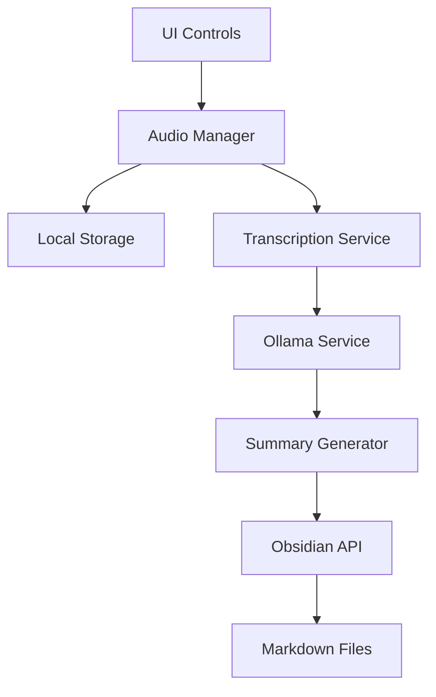

# Obsidian Meeting Notes Plugin - Project Context

## Project Overview
We're building an Obsidian plugin that provides automated meeting recording, transcription, and AI-powered summarization capabilities. The solution is designed to be completely local-first using Ollama for AI processing.

## Architecture Overview


## Core Components

### 1. Plugin Base
- Extends Obsidian's plugin architecture
- Manages plugin lifecycle
- Handles settings and configuration
- Provides UI integration points

### 2. Audio Recording Service
- Captures microphone input
- Records system audio
- Manages audio streams
- Handles start/stop functionality
- Saves temporary audio files

### 3. Transcription Pipeline
- Uses Whisper model via Ollama
- Processes audio in chunks
- Handles audio format conversion
- Manages transcription queue

### 4. Ollama Integration
- Manages connection to local Ollama instance
- Handles model loading and switching
- Provides unified API for different AI tasks
- Manages resource utilization

### 5. Summary Generator
- Processes transcripts using LLM
- Extracts key points and action items
- Generates structured summaries
- Creates follow-up tasks

### 6. File Management
- Creates and updates markdown files
- Manages file organization
- Handles template processing
- Integrates with Obsidian's file system

## Technical Requirements

### Development Environment
- Node.js 16+
- TypeScript 4.x
- Obsidian Plugin API
- Ollama CLI
- Required Models:
  - whisper (transcription)
  - mistral/llama2 (summarization)

### System Requirements
- 8GB+ RAM
- Modern multi-core CPU
- 4GB+ free storage
- OS: macOS/Linux/Windows

## Implementation Plan

### Phase 1: Project Setup
- Initialize Obsidian plugin structure
- Set up development environment
- Configure build pipeline
- Implement basic plugin lifecycle

### Phase 2: Audio Recording
- Implement audio capture
- Add recording controls
- Handle audio storage
- Test recording functionality

### Phase 3: Transcription
- Integrate Ollama
- Implement Whisper pipeline
- Add transcription queue
- Test accuracy and performance

### Phase 4: AI Processing
- Implement summary generation
- Add action item extraction
- Create template system
- Test AI capabilities

### Phase 5: UI/UX
- Add ribbon button
- Create settings panel
- Implement progress indicators
- Add error handling

### Phase 6: Testing & Polish
- End-to-end testing
- Performance optimization
- Documentation
- Release preparation

## File Structure
```
obsidian-meeting-notes/
├── src/
│   ├── main.ts                 # Plugin entry point
│   ├── audio/
│   │   ├── manager.ts          # Audio recording logic
│   │   └── utils.ts            # Audio utilities
│   ├── transcription/
│   │   ├── service.ts          # Transcription service
│   │   └── queue.ts            # Processing queue
│   ├── ollama/
│   │   ├── client.ts           # Ollama API client
│   │   └── models.ts           # Model management
│   ├── summary/
│   │   ├── generator.ts        # Summary generation
│   │   └── templates.ts        # Output templates
│   └── ui/
│       ├── ribbon.ts           # Ribbon button
│       └── settings.ts         # Settings tab
├── styles.css                  # Plugin styles
└── manifest.json              # Plugin manifest
```

## Development Guidelines

### Code Style
- Use TypeScript strict mode
- Follow Obsidian plugin conventions
- Implement error handling
- Add JSDoc comments
- Use async/await

### Testing Strategy
- Unit tests for core logic
- Integration tests for Ollama
- E2E tests for workflow
- Performance benchmarks

### Error Handling
- Graceful degradation
- User-friendly error messages
- Logging system
- Recovery mechanisms

### Performance Considerations
- Chunk large recordings
- Implement queuing
- Cache results
- Monitor memory usage

## API Interfaces

### Audio Manager
```typescript
interface AudioManager {
  startRecording(): Promise<void>;
  stopRecording(): Promise<Blob>;
  isRecording: boolean;
}
```

### Transcription Service
```typescript
interface TranscriptionService {
  transcribe(audio: Blob): Promise<string>;
  getProgress(): number;
}
```

### Summary Generator
```typescript
interface SummaryGenerator {
  generateSummary(transcript: string): Promise<Summary>;
}

interface Summary {
  keyPoints: string[];
  actionItems: string[];
  followUps: string[];
}
```
